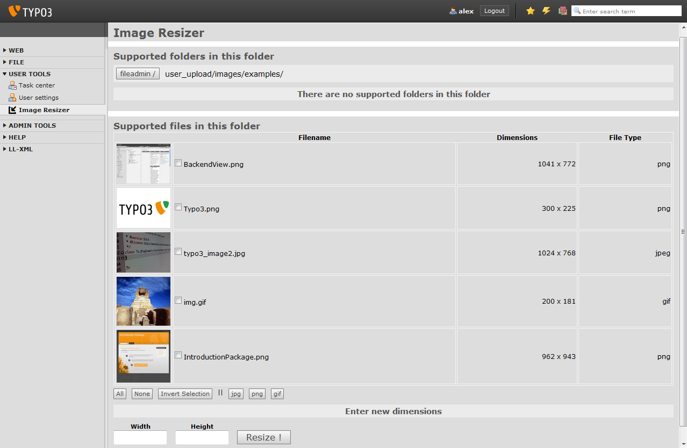

============
Users manual
============

Installation
============

**Install the extension**

Install the extension from the extension manager or download it from the TYPO3 extension repository (TER) at http://typo3.org/extensions/repository/view/aw_resize

**Prerequisites**

* An image manipulation library has to installed on the server and configured to work with TYPO3
* Read / Write permissions for the 'fileadmin' folder and all of its sub-folders
* An empty folder must be created under /fileadmin/user_upload titled 'dummy' this is used if the user does not have a filemount assigned to his/her usergoup
* The extension assumes that the folder structure of the installation has not been altered in any way and specifically the name of the /typo3 folder has remained unchanged

**Configuration**

None whatsoever

How it Works
=============

**Some Background**

The extension will try to find the filemount from the usergroup of the user currently logged in

* if many filemounts are assigned the first one will be used.
* if no filemounts are assigned '/fileadmin/user_upload/dummy' will be used as a fallback until a filemount is assigned
* if the user has admin rights then the user can access all the images under the fileamdin folder.
* if the user has admin rights and belongs to usergroups with filemounts all images can be accessed under fileamdin folder.

**Resize the images**

Just navigate to folder the images reside, select them, enter the new dimensions in the input fields below and hit 'Resize !'.
You should be able see the resized images right away in the table above.

Screenshots
==============

Tips and Tricks
===============
**Tip 1**

Always select an image that hasn't been resized yet as the source image otherwise you 'll end up with a rather
long filename eventually.